# 🤖 AI-Driven Intrusion Detection System - CIC-IDS2017


---

## 📌 Project Overview

This project implements a full **AI-driven Intrusion Detection System (IDS) pipeline** against the CIC-IDS2017 Friday Afternoon DDoS dataset (225,741 network flows). It was designed around four realistic CISO requirements: **precision**, **explainability**, **low false positives**, and **unseen-pattern detection**.

Two complementary detection models were implemented:

- ✅ **Random Forest (supervised)** - high-precision real-time DDoS classification (F1=0.9999, ROC-AUC=1.0000)
- ✅ **Isolation Forest (unsupervised)** - zero-day anomaly hunting without labelled attack samples
- ✅ **SHAP TreeExplainer** - global beeswarm plots + per-alert waterfall plots for sub-minute SOC analyst validation
- ✅ **Three-stage feature engineering** - Pearson correlation, RF Gini importance, Mutual Information (78 → 14 features)
- ✅ **Adversarial robustness analysis** - feature mimicry and low-and-slow evasion with mitigation strategies
- ✅ **UK GDPR & BCS ethics** - false positive harm, model bias, and data minimisation obligations

> 📄 **[Download the full project portfolio document →](./AI_IDS_Personal_Project_Ajoku.pdf)**

---

## 🧱 Pipeline Architecture

```
┌─────────────────────────────────────────────────────────────────┐
│              CIC-IDS2017 Friday Afternoon Dataset                │
│         225,741 flows | 78 features | 56.7% DDoS / 43.3% BENIGN│
└───────────────────────┬─────────────────────────────────────────┘
                        │
                        ▼
┌─────────────────────────────────────────────────────────────────┐
│                   DATA PREPARATION                               │
│  • Column whitespace strip (known CIC-IDS2017 artefact)         │
│  • Drop 4 missing rows (0.002%)                                  │
│  • Stratified 80/20 split → 180,592 train / 45,149 test         │
│  • Contamination ratio from training labels only (leakage fix)   │
└───────────────────────┬─────────────────────────────────────────┘
                        │
                        ▼
┌─────────────────────────────────────────────────────────────────┐
│               FEATURE ENGINEERING (3 Stages)                     │
│  Stage 1: Pearson correlation |r|>0.95  → 78 to 52 features     │
│  Stage 2: RF Gini importance            → rank 52 features       │
│  Stage 3: Mutual Information (MI)       → capture non-linear     │
│  Final:   RF importance > 0.01 ∩ MI top-30 → 14 features        │
└───────────────────────┬─────────────────────────────────────────┘
                        │
              ┌─────────┴─────────┐
              ▼                   ▼
┌─────────────────────┐ ┌─────────────────────────────┐
│   RANDOM FOREST     │ │     ISOLATION FOREST         │
│   100 trees         │ │     100 trees                │
│   max_depth=None    │ │     contamination=0.45        │
│   F1 = 0.9999       │ │     StandardScaler applied    │
│   AUC = 1.0000      │ │     F1 = 0.375, AUC = 0.2825 │
│   3 misclassified   │ │     Zero-day hunting role     │
└─────────┬───────────┘ └─────────────────────────────┘
          │
          ▼
┌─────────────────────────────────────────────────────────────────┐
│                SHAP TreeExplainer                                │
│  • Global beeswarm: Fwd Pkt Len Max (0.095) dominant feature    │
│  • Per-alert waterfall: sub-minute analyst validation            │
│  • LIME rejected: approximation error unacceptable in SOC        │
└─────────────────────────────────────────────────────────────────┘
```

---

## 🗂️ Project Structure

```
ai-ids-cic-ids2017/
│
├── README.md
├── AI_IDS_Personal_Project_Ajoku.pdf       ← Full portfolio document
│
└── screenshots/
    ├── 01_label_distribution.png
    ├── 02_contamination_ratio.png
    ├── 03_correlation_heatmap.png
    ├── 04_pearson_correlation_code.png
    ├── 05_rf_importance_code.png
    ├── 06_mutual_information_code.png
    ├── 07_final_14_features.png
    ├── 08_rf_mi_comparison_chart.png
    ├── 09_model_performance_table.png
    ├── 10_roc_curves.png
    ├── 11_confusion_matrices.png
    ├── 12_shap_beeswarm_global.png
    ├── 13_shap_true_positive.png
    ├── 14_shap_false_positive.png
    ├── 15_dataset_loading_code.png
    ├── 16_label_distribution_output.png
    ├── 17_rf_training_code.png
    ├── 18_if_training_code_pt1.png
    ├── 19_if_training_code_pt2.png
    ├── 20_shap_global_code.png
    └── 21_shap_individual_code.png
```

---

## ⚙️ Tech Stack

| Component | Role |
|---|---|
| **Python 3.x** | Primary implementation language |
| **pandas** | Dataset loading, cleaning, and preprocessing |
| **scikit-learn** | Random Forest, Isolation Forest, StandardScaler, train_test_split |
| **SHAP** | TreeExplainer - global and individual prediction explanations |
| **matplotlib / seaborn** | Visualisation - heatmaps, ROC curves, beeswarm plots |
| **CIC-IDS2017** | Benchmark dataset (Canadian Institute for Cybersecurity) |

---

## 🔍 Part 1 - Dataset & Feature Engineering

### Dataset

The CIC-IDS2017 Friday Afternoon subset captures a DDoS attack scenario with realistic background traffic:

| Label | Count | Proportion |
|---|---|---|
| DDoS | 128,027 | 56.71% |
| BENIGN | 97,714 | 43.29% |
| **TOTAL** | **225,741** | **100%** |

```python
import pandas as pd
from sklearn.model_selection import train_test_split

df = pd.read_csv('Friday-WorkingHours-Afternoon-DDos.pcap_ISCX.csv')
df.columns = df.columns.str.strip()           # fix known CIC-IDS2017 artefact
df.dropna(inplace=True)                        # drop 4 missing rows

X = df.drop('Label', axis=1)
y = df['Label']

X_train, X_test, y_train, y_test = train_test_split(
    X, y, test_size=0.2, random_state=42, stratify=y
)
```

### Three-Stage Feature Engineering

```python
# Stage 1: Pearson Correlation - remove redundant features
import numpy as np
corr_matrix = X_train.corr().abs()
upper = corr_matrix.where(np.triu(np.ones(corr_matrix.shape), k=1).astype(bool))
to_drop = [col for col in upper.columns if any(upper[col] > 0.95)]
X_train_reduced = X_train.drop(columns=to_drop)  # 78 → 52 features

# Stage 2: RF Gini Importance
from sklearn.ensemble import RandomForestClassifier
rf_selector = RandomForestClassifier(n_estimators=50, random_state=42)
rf_selector.fit(X_train_reduced, y_train)
importances = pd.Series(rf_selector.feature_importances_, index=X_train_reduced.columns)
rf_selected = importances[importances > 0.01].index.tolist()

# Stage 3: Mutual Information
from sklearn.feature_selection import mutual_info_classif
mi_scores = mutual_info_classif(X_train_reduced, y_train, random_state=42)
mi_series = pd.Series(mi_scores, index=X_train_reduced.columns).nlargest(30)
mi_selected = mi_series.index.tolist()

# Final: intersection
final_features = list(set(rf_selected) & set(mi_selected))  # 14 features
```

### Screenshots

| Fig 1 - Label Distribution | Fig 2 - Contamination Ratio (Leakage Fix) |
|---|---|
| 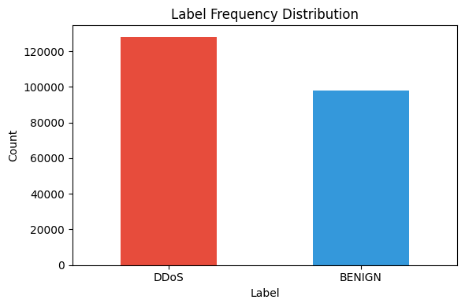 | 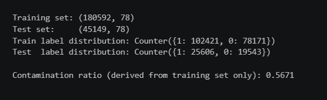 |

| Fig 3 - Correlation Heatmap (52 features) | Fig 4 - Pearson Correlation Code |
|---|---|
| 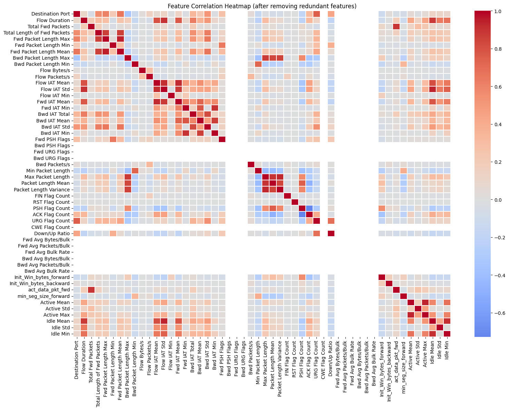 | 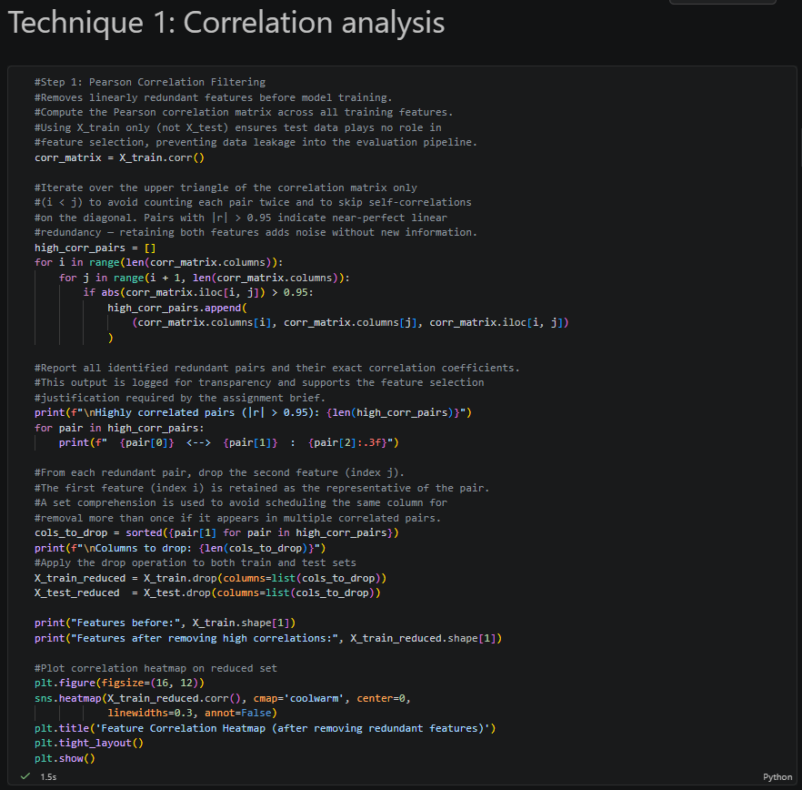 |

| Fig 5 - RF Importance Code | Fig 6 - Mutual Information Code |
|---|---|
| 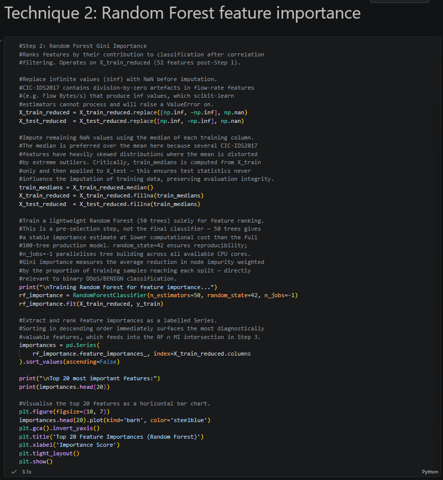 | 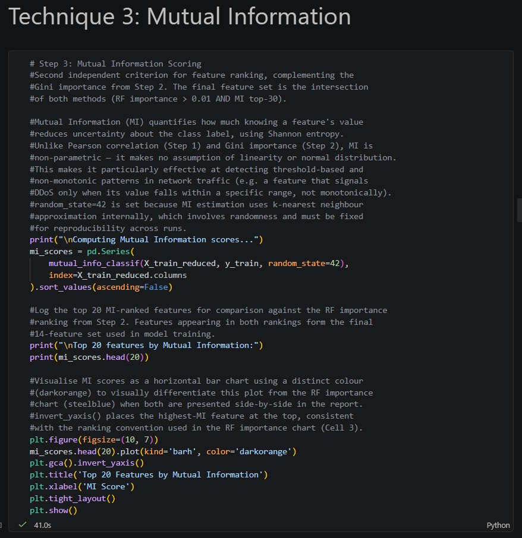 |

| Fig 7 - Final 14 Features | Fig 8 - RF vs MI Comparison Chart |
|---|---|
| 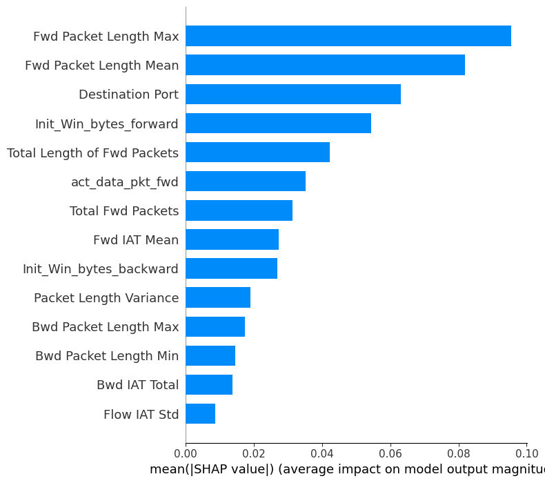 | 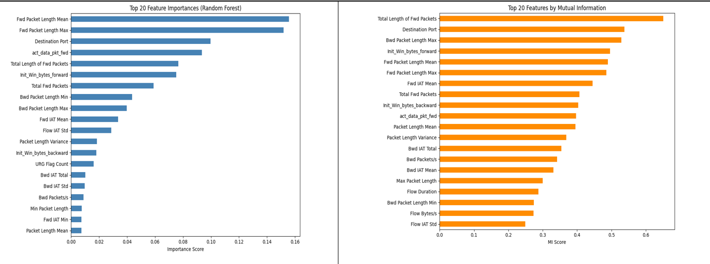 |

---

## ⚔️ Part 2 - Model Development

### Random Forest (Supervised)

```python
from sklearn.ensemble import RandomForestClassifier

rf = RandomForestClassifier(n_estimators=100, max_depth=None, random_state=42)
rf.fit(X_train[final_features], y_train)
y_pred_rf = rf.predict(X_test[final_features])
```

### Isolation Forest (Unsupervised)

```python
from sklearn.ensemble import IsolationForest
from sklearn.preprocessing import StandardScaler

# Contamination derived from training labels ONLY - not full dataset
contamination = (y_train == 'DDoS').mean()   # 0.5671 → capped at 0.45
contamination = min(contamination, 0.45)

scaler = StandardScaler()
X_train_scaled = scaler.fit_transform(X_train[final_features])
X_test_scaled = scaler.transform(X_test[final_features])

iso = IsolationForest(n_estimators=100, contamination=contamination, random_state=42)
iso.fit(X_train_scaled)
```

> **Why StandardScaler for IF but not RF?** RF is scale-invariant (tree-based splits). IF uses random partitioning - without scaling, high-magnitude features dominate regardless of discriminating power.

### Model Performance

| Model | Precision | Recall | F1-Score | ROC-AUC |
|---|---|---|---|---|
| **Random Forest** | 0.9999 | 0.9999 | **0.9999** | **1.0000** |
| Isolation Forest | 0.424 | 0.336 | 0.375 | 0.2825* |

*IF AUC < 0.5 reflects score inversion when contamination → 0.5 - a known mathematical effect, not model failure (Liu, Ting and Zhou, 2012).

| Fig 9 - Performance Table | Fig 10 - ROC Curves |
|---|---|
| 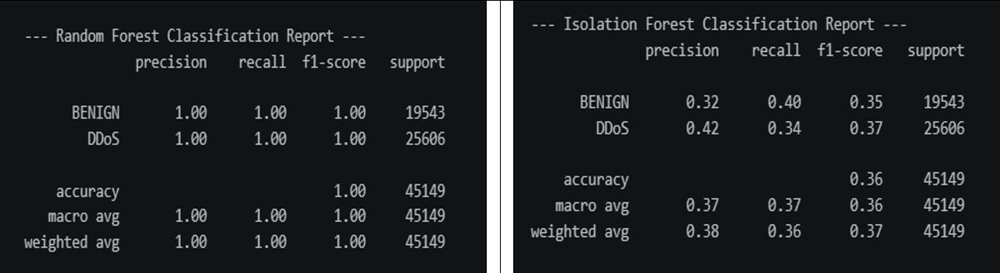 | 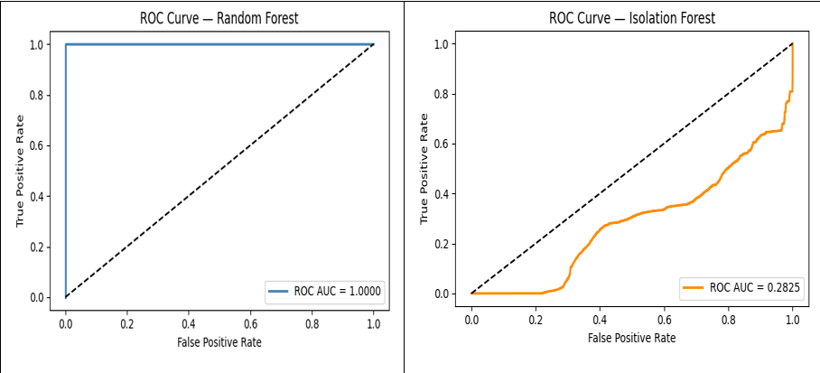 |

| Fig 11 - Confusion Matrices |  |
|---|---|
| 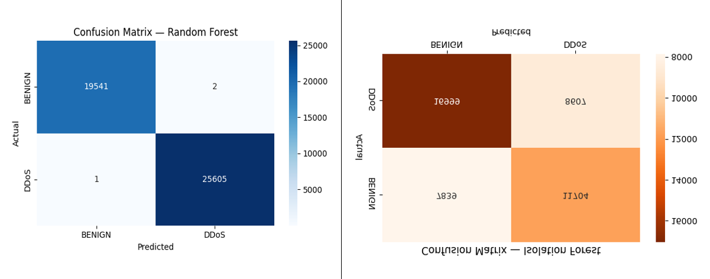 | |

**Confusion matrix breakdown:**

| Model | TN | FP | FN | TP |
|---|---|---|---|---|
| Random Forest | 19,541 | 2 | 1 | 25,605 |
| Isolation Forest | 7,839 | 11,704 | 16,999 | 8,607 |

---

## 🔎 Part 3 - Explainability (SHAP)

### Why SHAP Over LIME

LIME's local linear surrogate introduces approximation error. SHAP provides **exact Shapley values** from cooperative game theory - essential for a SOC deployment where analyst trust depends on explanation accuracy (Lundberg and Lee, 2017).

### Global Feature Importance

```python
import shap

explainer = shap.TreeExplainer(rf)
shap_values = explainer.shap_values(X_test[final_features].iloc[:500])
shap.summary_plot(shap_values[1], X_test[final_features].iloc[:500])
```

**Top features by mean |SHAP| value:**

| Rank | Feature | Mean |SHAP| | Interpretation |
|---|---|---|---|
| 1 | Fwd Pkt Len Max | 0.095 | Short uniform fwd packets = DDoS SYN flood signature |
| 2 | Fwd Pkt Len Mean | 0.082 | Consistent with short DDoS packet streams |
| 3 | Init_Win_bytes_forward | 0.043 | Minimal TCP window size reinforces DDoS classification |
| 4 | Destination Port | 0.033 | Port 80 targeted in SYN flood pattern |

### Individual Prediction Examples

| Example | Type | Top SHAP Driver | Value | SHAP | Analyst Note |
|---|---|---|---|---|---|
| 1 | True Positive | Fwd Packet Length Max | 20 | +0.095 | Short uniform fwd pkts = SYN flood |
| 2 | True Positive | Init_Win_bytes_forward | 256 | +0.043 | Minimal TCP window reinforces DDoS |
| 3 | False Positive | Total Len Fwd Packets | 18 | -0.203 | Small total fwd len drove FP |
| 4 | False Positive | Init_Win_bytes_forward | 256 | +0.076 | Competing signal partly offset FP |

| Fig 12 - SHAP Beeswarm (Global) | Fig 13 - True Positive Waterfall |
|---|---|
| 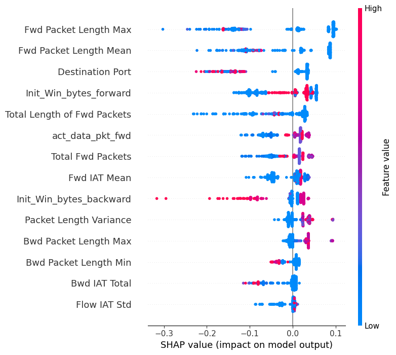 | 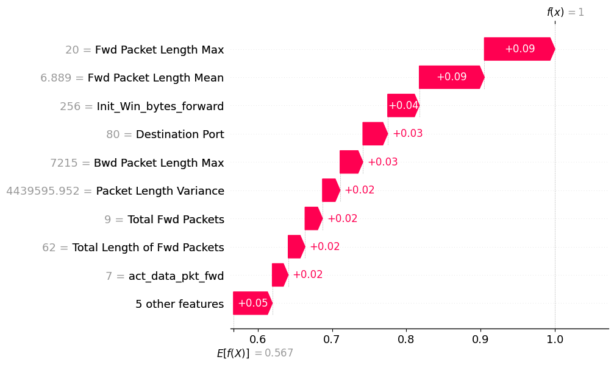 |

| Fig 14 - False Positive Waterfall |  |
|---|---|
| 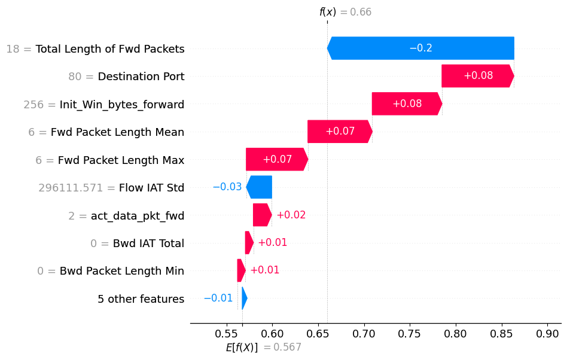 | |

---

## ⚠️ Adversarial Robustness

| Attack Vector | Description | Mitigation |
|---|---|---|
| **Feature Mimicry** | Craft DDoS packets with Fwd Pkt Len Max in BENIGN range - evades RF decision boundary (Alshahrani et al., 2022) | Adversarial retraining cadence - retrain RF on newly detected adversarial samples |
| **Low-and-Slow** | Spread flows across many sessions over days - per-flow stats stay below anomaly thresholds, defeats both RF and IF (Ibitoye et al., 2023) | IF-based input sanitisation - flag feature vectors outside training distribution before RF scoring |
| **Model Bias** | RF trained only on DDoS; performance on infiltration/exfiltration unknown | Multi-day CIC-IDS2017 training; quarterly retraining on diverse attack samples |

---

## 🔒 Ethics & UK GDPR

- **Personal data:** network flow metadata captures employee activity - UK GDPR Article 5 purpose limitation and data minimisation obligations apply
- **False positive harm:** blocking legitimate traffic = denial-equivalent harm; precision/recall balance is an ethical consideration, not merely a technical one (Stallings and Brown, 2018)
- **Model bias:** a DDoS-trained classifier deployed as a general-purpose IDS creates false coverage confidence - undisclosed detection gaps may be more dangerous than acknowledged ones
- **BCS Code of Conduct (2024):** practitioners must consider wider public interest when deploying ML systems affecting data subjects

---

## 🎯 CISO Recommendations

| # | Recommendation | Rationale |
|---|---|---|
| 1 | Deploy RF as primary detection engine | F1=0.9999; daily retraining cadence counters feature mimicry |
| 2 | Run IF in parallel as zero-day hunting layer | Label-free; detects novel patterns without labelled attack samples |
| 3 | Surface SHAP waterfall plots per SOC alert | Sub-minute analyst validation; reduces alert fatigue |
| 4 | Implement adversarial retraining cadence | Maintains RF decision boundary against evolving evasion techniques |
| 5 | Define GDPR-compliant flow retention policy | Flow metadata = personal data; purpose limitation obligations apply |

---

## 🧠 Frameworks & References

| Framework / Reference | Application |
|---|---|
| **CIC-IDS2017** (Sharafaldin et al., 2018) | Benchmark dataset - realistic DDoS + BENIGN traffic |
| **MITRE ATT&CK** | DDoS detection context and adversarial TTP mapping |
| **UK GDPR / DPA 2018** | Data minimisation, purpose limitation, retention obligations |
| **BCS Code of Conduct (2024)** | Practitioner ethics for ML systems affecting data subjects |
| Breiman (2001) | Random Forest - variance reduction via bagging |
| Liu, Ting & Zhou (2012) | Isolation Forest - label-free anomaly detection |
| Lundberg & Lee (2017) | SHAP - exact Shapley values for model explanation |
| Lundberg et al. (2020) | SHAP for trees - global understanding from local explanations |
| Ribeiro, Singh & Guestrin (2016) | LIME - rejected due to approximation error |
| Capuano et al. (2022) | XAI in cybersecurity - SOC trust and alert fatigue |
| Halder & Ozdemir (2018) | ML for cybersecurity - feature engineering principles |
| Alshahrani et al. (2022) | Adversarial attacks against ML-based IDS |
| Ibitoye et al. (2023) | Adversarial ML attacks survey - low-and-slow evasion |
| Tsukerman (2019) | ML for cybersecurity cookbook - leakage and evaluation rigour |
| Kolosnjaji (2024) | AI for cybersecurity - XGBoost comparison |
| Stallings & Brown (2018) | Computer security principles - false positive ethics |

---

## 👤 Author

**Toochukwu Praise Ajoku**
MSc Cyber Security - Keele University (2026)
Student Member, CIISec

[](https://www.linkedin.com/in/toochukwu-praise-ajoku/)

---

*This project was conducted using a publicly available research dataset (CIC-IDS2017) for educational and portfolio purposes. No real network infrastructure was targeted.*
